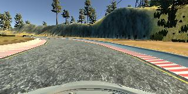
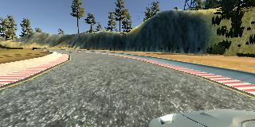
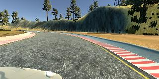
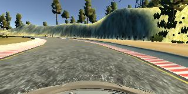

# **Behavioral Cloning**

## Writeup Template

### You can use this file as a template for your writeup if you want to submit it as a markdown file, but feel free to use some other method and submit a pdf if you prefer.

---

**Behavioral Cloning Project**

The goals / steps of this project are the following:
* Use the simulator to collect data of good driving behavior
* Build, a convolution neural network in Keras that predicts steering angles from images
* Train and validate the model with a training and validation set
* Test that the model successfully drives around track one without leaving the road
* Summarize the results with a written report


[//]: # (Image References)


[image1]: ./examples/placeholder.png "Model Visualization"
[image2]: ./examples/placeholder.png "Grayscaling"
[image3]: ./examples/placeholder_small.png "Recovery Image"
[image4]: ./examples/placeholder_small.png "Recovery Image"
[image5]: ./examples/placeholder_small.png "Recovery Image"
[image6]: ./examples/placeholder_small.png "Normal Image"
[image7]: ./examples/placeholder_small.png "Flipped Image"

## Rubric Points
### Here I will consider the [rubric points](https://review.udacity.com/#!/rubrics/432/view) individually and describe how I addressed each point in my implementation.  

---
### Files Submitted & Code Quality

#### 1. Submission includes all required files and can be used to run the simulator in autonomous mode

My project includes the following files:
* model.py containing the script to create and train the model
* drive.py for driving the car in autonomous mode
* model.h5 containing a trained convolution neural network
* writeup_report.md summarizing the results

#### 2. Submission includes functional code
Using the Udacity provided simulator and my drive.py file, the car can be driven autonomously around the track by executing
```sh
python drive.py model.h5
```

#### 3. Submission code is usable and readable

The model.py file contains the code for training and saving the convolution neural network. The file shows the pipeline I used for training and validating the model, and it contains comments to explain how the code works.

### Model Architecture and Training Strategy

#### 1. An appropriate model architecture has been employed

My model includes RELU layers to introduce nonlinearity, and the data is normalized in the model using a Keras lambda layer.
The convolution layers are meant to handle feature engineering and the fully connected layer for predicting the steering angle.

#### 2. Attempts to reduce overfitting in the model

The model contains dropout layers in order to reduce overfitting after the convolution layers.
The model was trained and validated on different data sets to ensure that the model was not overfitting. The model was tested by running it through the simulator and ensuring that the vehicle could stay on the track.

#### 3. Model parameter tuning

The model used an adam optimizer with learning rate of 1.0e-4.

#### 4. Appropriate training data

Training data was chosen to keep the vehicle driving on the road. I used a combination of center lane driving, recovering from the left and right sides of the road. For left image, steering angle is adjusted by +0.2, and for right image, steering angle is adjusted by -0.2. I also flipped images to get more data.

For details about how I created the training data, see the next section.

### Model Architecture and Training Strategy

#### 1. Solution Design Approach

The overall strategy for deriving a model architecture was to use convolutional layers for automated feature engineering by process image data and steering angle data.

My first step was to use a convolution neural network model similar to the NVIDIA model,  which has been used by NVIDIA for the end-to-end self driving test. I thought this model might be appropriate because it has been used by NVIDIA for the end-to-end self driving test.

In order to gauge how well the model was working, I split my image and steering angle data into a training and validation set. I found that my first model had a low mean squared error on the training set but a high mean squared error on the validation set. This implied that the model was overfitting.

To combat the overfitting, I modified the model so that it has a dropout layer to reduce overfitting.

Then I used 4 fully connected layers for predicting the steering angle.

The final step was to run the simulator to see how well the car was driving around track one. There were a few spots where the vehicle fell off the track at first, and I added flipped images to improve the driving behavior in these cases.

At the end of the process, the vehicle is able to drive autonomously around the track without leaving the road.

#### 2. Final Model Architecture

The final model architecture consisted of a convolution neural network with the following layers and layer sizes:
* Image normalization
* Cropping2D
* Convolution: 5x5, filter: 24, strides: 2x2, activation: RELU
* Convolution: 5x5, filter: 36, strides: 2x2, activation: RELU
* Convolution: 5x5, filter: 48, strides: 2x2, activation: RELU
* Convolution: 3x3, filter: 64, strides: 1x1, activation: RELU
* Convolution: 3x3, filter: 64, strides: 1x1, activation: RELU
* Drop out
* Fully connected: neurons: 100, activation: RELU
* Fully connected: neurons: 50, activation: RELU
* Fully connected: neurons: 10, activation: RELU
* Fully connected: neurons: 1 (output)

#### 3. Creation of the Training Set & Training Process

To capture good driving behavior, I first recorded two laps on track one using center lane driving. Here is an example image of center lane driving:



I then recorded the vehicle recovering from the left side and right sides of the road back to center so that the vehicle would learn to steer if the car drifts off to the left or the right. These images show what a recovery looks like starting from the sides of the road :




Then I repeated this process on track two in order to get more data points.

To augment the data set, I also flipped images and angles thinking that this would let data more comprehensive. For example, here is an image that has then been flipped:




After the collection process, I had 22862 data points. I then processed this data by my model.

I finally randomly shuffled the data set and put 20% of the data into a validation set.

I used this training data for training the model. The validation set helped determine if the model was over or under fitting. The ideal number of epochs was 3 as evidenced by tunning it for several times. I used an adam optimizer so that manually training the learning rate wasn't necessary.
